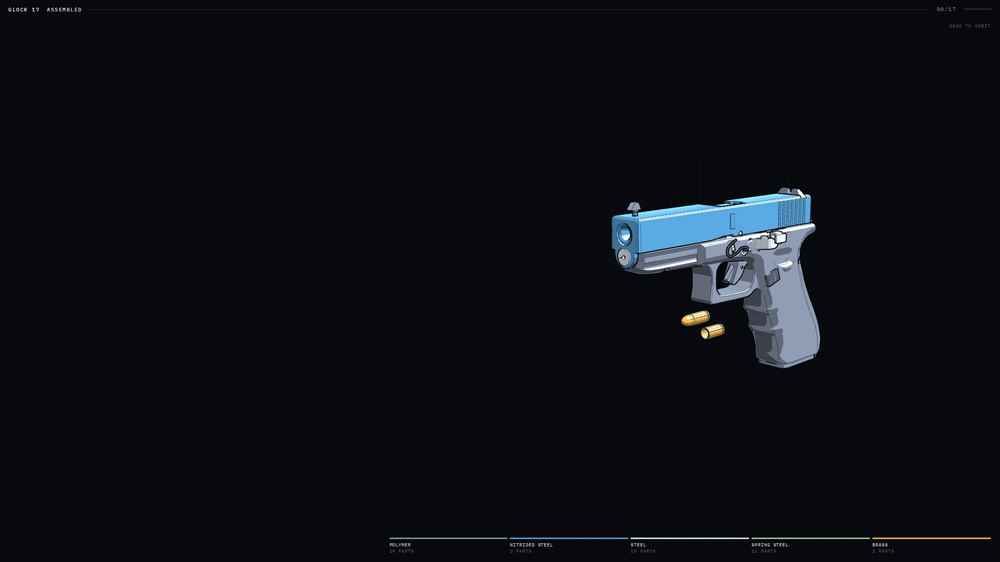
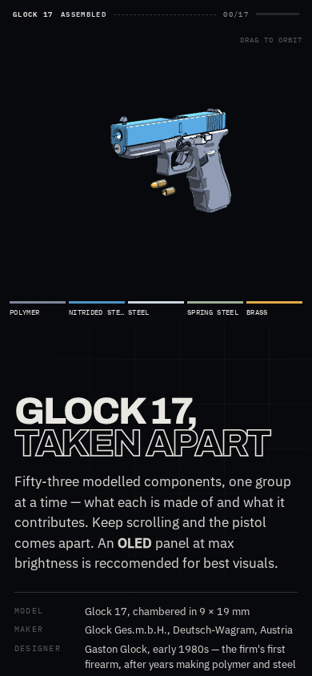
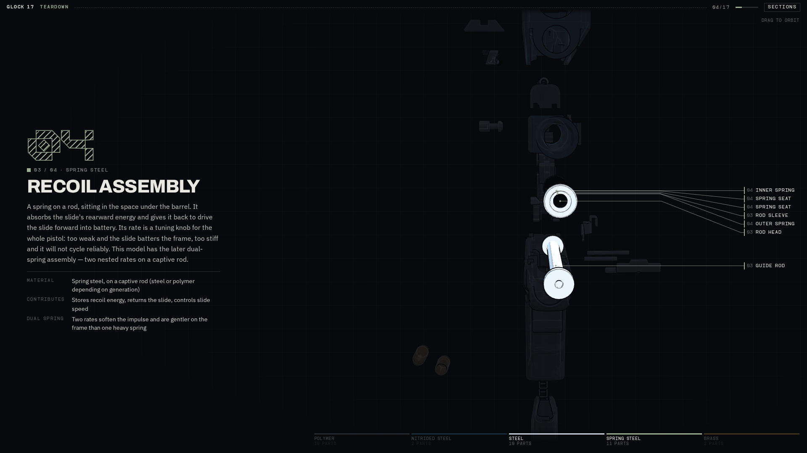
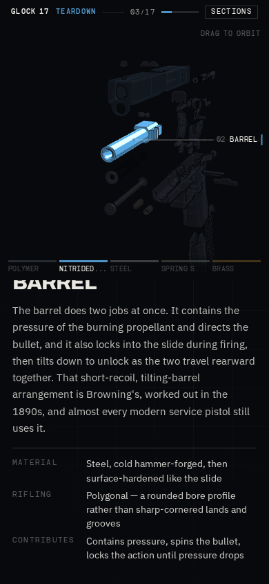

# Process overview

A reading-guide to how the work came together --- a map to your process, not an
essay about it.

## What I built

An interactive scrollytelling teardown of a Glock 17: a cel-shaded three.js
model that flies apart into 18 material-grouped sections as you scroll ---
polymer, nitrided steel, steel, spring steel, brass --- each with what it's
made of and what it contributes, then reassembles under scroll control in the
outro. The idea started as an impulse: an Instagram reel about the anime.js
library, and a wish to riff on the assignment brief's own mechanical-watch
exemplar.

## The moments that mattered

**Prototyping outside the harness, then anchoring it as the exemplar.**
I built the first version on my phone in plain Claude Online, not the
agentic repo --- less context there means faster iteration on half-formed
ideas, which suited brainstorming better than a real harness would. That
produced `g17_teardown.html`, `g17_components.glb`, and a process log ---
about 80% of the way to shippable, so re-deriving it inside the harness
would only burn tokens re-solving a solved problem. Instead I rewrote
CLAUDE.md's placeholder "This file is yours" section into "References to
point to", pointing straight at that output
([`ad992da`](https://github.com/comp4020-agentic-coding-studio/comp4020-ass1-deadmobzer/commit/ad992da))
and telling the agent its job was to port that 80%-there work into the
assignment template, not redesign it.

 

**Static markup over runtime construction.** The spec requires a static
page; `g17_teardown.html` built everything at runtime via JS. Rather than
patch that in place, `index.html`/`main.js`/`styles.css` were restructured
so sections and nav exist as static, data-attribute-driven markup, with
`main.js` only enhancing it --- so the invariants tests (single `h1`, nav
landmark) check the markup itself, not whatever the JS happens to construct
([`eddf5c9`](https://github.com/comp4020-agentic-coding-studio/comp4020-ass1-deadmobzer/commit/eddf5c9)).

 

**The ambience "bug."** Ambience audio wasn't audible, and my first read
was Firefox blocking autoplay --- plausible, since playback is already
gated behind a scroll/pointerdown event for that reason. The real cause
was narrower: `ambienceStarted` was initialized to `true` instead of
`false`, so that gate never fired. Confirmed by monkeypatching
`HTMLMediaElement.prototype.play` in Playwright and watching it fire once
fixed. That same setup could confirm the audio *fired*, not that it was at
a sane *volume* --- I tuned that by ear, a gap I'd close next with an
automated gain-ceiling check
([`9055c75`](https://github.com/comp4020-agentic-coding-studio/comp4020-ass1-deadmobzer/commit/9055c75)).

**The font swap that needed a second pair of eyes.** Swapping in Neoblast
and TBJ Monodrip everywhere read as illegible, to me and to my mother, my
second opinion --- headings reverted to Archivo, Neoblast scoped down to
just the section numbers. Next time I'd mock up type and colour in Figma
before applying a full-page swap live
([`9055c75`](https://github.com/comp4020-agentic-coding-studio/comp4020-ass1-deadmobzer/commit/9055c75)
--- this commit shows only the corrected end state; the illegible version
was fixed in-session and never committed alone).

 

## Before you ship

`pnpm check:evidence` verifies your citations resolve to real commits, that the
current reflection entry is in `reflections/`, and that your `CLAUDE.md` is
there --- before a marker ever opens the file. It checks that your map is
traceable, not that it is good: the marker judges whether your small,
deliberately chosen set of moments shows real judgement and reflection. A green
check is not a substitute for that curation.

Images are deliberately not checked, because whether one renders is visible the
moment you look. Open this file on GitHub and look at it before you ship.
